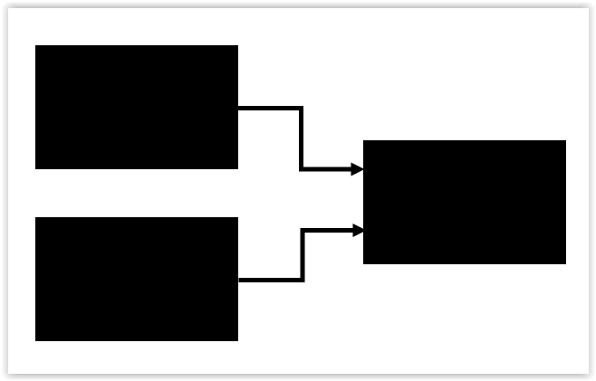
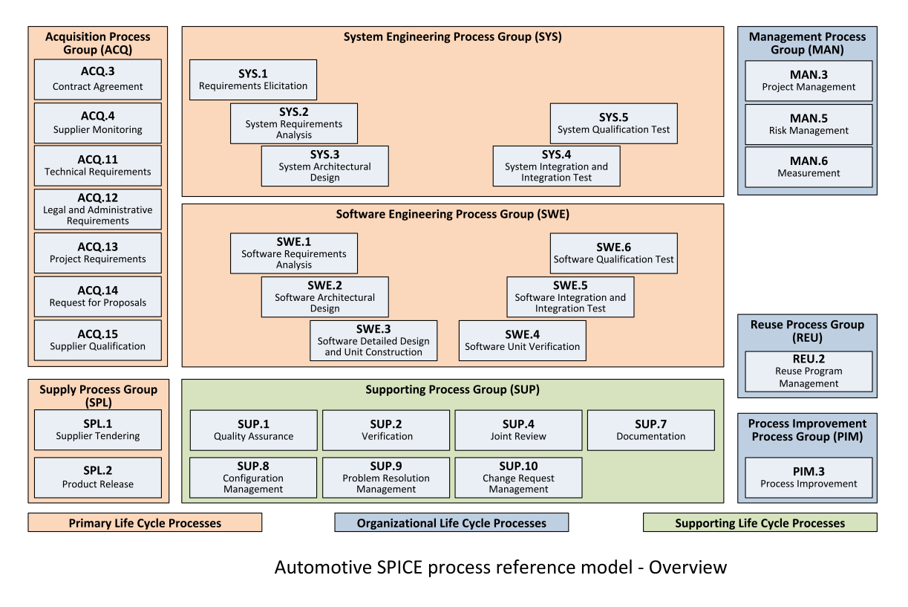
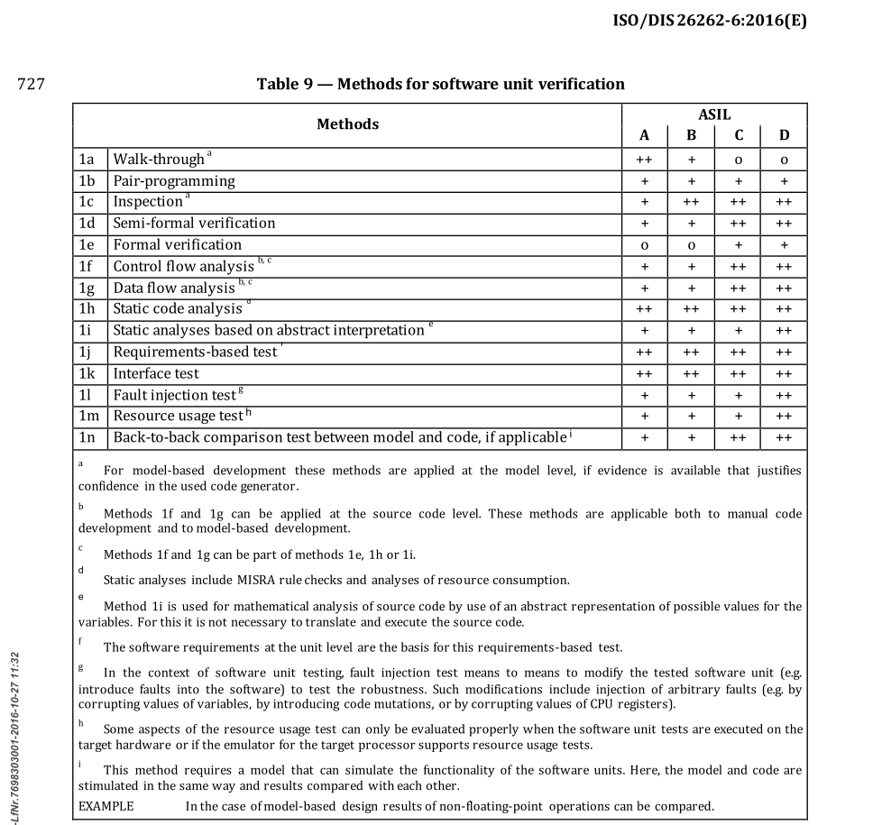
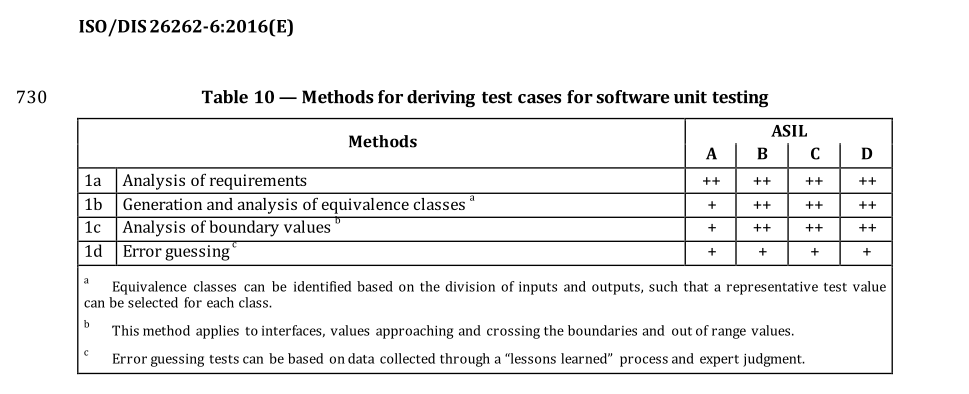

## Yet Another Presentation About Testing

Note:

Hey everybody!

As the title already suggests, we will be talking about testing

*short pause*

software.

When starting writing software, it is often asked in the SW Community

``Which tool should I use for testing?``
 
and one gets a long list of names.

I would answer with a question:

``Can you test?``

The reason why I'll be asking this question,
is that independent on the tool one uses
if one does not know how to test
the end result will most probably 

*short pause*

suck!

This is the reason, why we reconsider out trainings 
and first start with `how to test`
and then `how to test using a tool like GoogleTest`.

With no further ado let's see

*next slide*

`Who Should be here?`

--

## Who Should Be Here?

- your profession is Software Engineer <!-- .element: class="fragment monospace" -->
- you solve problems with SW <!-- .element: class="fragment monospace" -->
- a.k.a. "The Expert" <!-- .element: class="fragment monospace" -->

Note:

You should be here if 

// emphasize the word 'profession' !
your _profession_ is SW Engineer

or 

you solve most of your problems with software

or

you are famous for fixing very fast someone elses software problems

I think it is important to keep in mind that SW engineering is a _profession_
and this implies so much more than writing software :D

*next slide*

--

## How do you develop your software?

Note:

Ok

*short pause*

now how to _solve everything with software_ ?

well

*short pause*

*click to show next item on the current slide*

this depends on your super powers

There are two types of people in this world,
both with their own style of working

On one side we have _normal people_

and on the other side we have _Chuck Norris_ :)

*next slide*

--

<!-- .slide: data-background-image="images/training_how_to_develop_001.png" data-background-size="cover" -->

Note:

Let's see first the _Chuck Norris Style_

``Create``

and

``Deliver``

We are sure that if Chuck Norris created something
it was for a good reason and it will work

This is actually a good core value _TRUST_

*next slide*

--

<!-- .slide: data-background-image="images/training_how_to_develop_002.png" data-background-size="cover" -->

Note:

On the other hand we have _humans_

therefore between `create` and `deliver`

one must insert a new step

`CHECK`

I think we all fall in the second category (normal people)

therefore we should focus on two things

- how to approach this `Check` step

and

- how can we optimize this loop 

`Create` -> `Check` -> `Create` -> `Check`

*short pause* (and check the audience)

Hmmm ... I know that some of you think they belong to the first category

Fortunately we can test this now fast!

You know, there are some scientifically proven facts about Chuck Norris

*next slide*

--

When Chuck Norris code does not compile, <!-- .element: class="monospace" -->

the compiler apologizes. <!-- .element: class="monospace" -->

Note:
*Read the text from the slide*

If your code does not compile
and the compiler does _not_ apologize to you

well

_you are NOT Chuck Norris_

*next slide*

--

Chuck Norris does not debug his code, <!-- .element: class="monospace" -->

he stares down the code until the code confesses all bugs. <!-- .element: class="monospace" -->

Note:

*Read the text from the slide*

If you have to debug your code 

well

_you are NOT Chuck Norris_

*next slide*

--

<!-- .slide: data-background-image="images/training_how_to_develop_003.png" data-background-size="cover" -->

--

## How to check your code?

- testing environment <!-- .element: class="fragment monospace" -->
- design your tests <!-- .element: class="fragment monospace" -->
- run your tests and check the results <!-- .element: class="fragment monospace" -->

--

## Testing Environment

[Yet Another Testing Attempt](Yet_another_testing_attempt.pdf)

--

## Types of Code

- Production Code (PC) <!-- .element: class="fragment monospace" -->
- Test Code (TC) <!-- .element: class="fragment monospace" -->
- Mockup Code (MC) <!-- .element: class="fragment monospace" -->
- Framework Code (FC) <!-- .element: class="fragment monospace" -->

--

## Test Design (Theory)

Note:

Now comes the part were we try not to fall a sleep ... _laugth_
The next slides are about test design theory. 

*next slide*

--

## Testing Techniques

- <!-- .element: class="fragment" data-fragment-index="1"--> Static
  - <!-- .element: class="fragment" data-fragment-index="3"--> static code analysis (CPPCheck, Polyspace)
  - <!-- .element: class="fragment" data-fragment-index="4"--> code review
- <!-- .element: class="fragment" data-fragment-index="2"--> Dynamic
  - <!-- .element: class="fragment" data-fragment-index="5"--> specification based 
  - <!-- .element: class="fragment" data-fragment-index="6"--> structure based 
  - <!-- .element: class="fragment" data-fragment-index="7"--> experience based

Note:

When it comes to testing techniques or testing methods,
there are two major categories: 

static and dynamic testing techniques.

The static testing techniques, are preventive methods where
someone or some tool is checking the source code without
executing it.

In this category we have

- static code analysis with tools like QAC or Polyspace

or

- nice colleagues that can do a code review

_short pause_

On the other hand we have the dynamic testing techniques,
where the code will be executed in order to verify its behavior.

in this category we have

- specification based testing, where we test against the specified
behavior, against the requirements.

- structure based testing, where, for example, we want to make sure that
a certain parts of the code get executed. These are additional tests
aimed to increase the code coverage.

and then we have

- experience based testing, where we use the things we've learned 
the hard way over the years and create test cases to make sure 
they do not happen again.
These are usually the test cases someone writes when there is not
enough time to properly design and execute all tests ...

_short pause_

We will focus on only the two underlined topics:

specification based and structure based testing.

*next slide*

--

## Dynamic Testing Techniques

Specification based

- use case testing <!-- .element: class="fragment monospace" -->
- boundary value analysis <!-- .element: class="fragment monospace" -->
- equivalence partitioning <!-- .element: class="fragment monospace" -->
- state transition testing <!-- .element: class="fragment monospace" -->
- decision table <!-- .element: class="fragment monospace" -->

Note:

Let's start with the _specification based_ testing techniques.

The list you see is not meant to be complete, 
but only mentions some techniques in an order
which we think you will most likely used them
in practice.

We will briefly go over all of them, for more in depth examples,
just google for it!

Ok, the first technique is the _use case testing_.
Yes, the software behavior is always specified
in one way or another, more or less formal.
Based on some use cases about how the software shall behave,
we create test scenarios to make sure the software behaves
as expected.

We then have _boundary value analysis_.
In this case you focus on how the software behaves when
the inputs take the minimum or maximum value in their
specified range.
Or if the provided outputs reach their specified
minimum and maximum values and remain in the specified range.

Then we have _equivalence partitioning_.
Here we try to avoid useless tests.
What I mean by that is that from all possible values
of an input or output only some are worth testing.

Consider a simple function that return true if the input is greater
than zero and let's say the input is a signed byte, so from minus 128 to 127.

Shall we write a test for every value between minus 128 to 127?

No! The input can be either negative, positive or zero.

Next, we've got _state transition testing_.
As the name suggest, we focus here on the _states_ our component
might be and the _transitions_ between them.
As you can see, this technique is useful to design tests
for state machines.

The last one in our list is the _decision table_ technique.
This is another test design technique used to design and
structure the tests in order to get a better overview of what is tested.
In a decision table, one takes a _cause-effect_ approach.
We define conditions and actions and design tests based on
which actions shall be triggered if certain conditions are met.

*next slide*

--

## Dynamic Testing Techniques

Structure based

- statement coverage <!-- .element: class="fragment monospace" -->
- decision coverage <!-- .element: class="fragment monospace" -->
- condition coverage <!-- .element: class="fragment monospace" -->
- modified condition/decision coverage <!-- .element: class="fragment monospace" -->

Note:

The structure based design techniques are used to
design tests to make sure certain parts of the code are executed.

The least required is that every line in the code gets executed
when running the tests. When having no conditional paths
in the code, one test case is enough to have 100% statement coverage.

When having a conditional statement, let's say _if-else_ blocks,
one needs to test both the _if_ and the _else_ execution paths.
A decision coverage will report the execution paths coverage.

When dealing with complex conditions, having _AND_/_OR_ operators,
the condition coverage will measure the conditions independent of 
each other and requires them to be evaluated as both _true_ and _false_.

The compromise to testing all possible combinations in a decision (full test coverage),
is the MC-DC coverage. MC-DC coverage doe not require those combinations to be tested,
for which changing the value of one condition element does not affect the condition result.

*next slide*

--

## Testing Perspectives 📦

--

## Black Box
<!-- .slide: data-background-color="black" -->

  

    
  

  

    <ul>
      <li class="monospace">no knowledge of implementation</li>
      <li class="monospace">test against requirements</li>
    </ul>
  

Note:

Now we will discuss to which extent we should use the source code,
the implementation, for designing the tests.

We can look at the code as a _black box_. We can only manipulate its inputs
and verify its outputs. We have no knowledge about the internal implementation.

One huge advantage of designing black box tests is that the tests will not have to be
changed if the implementation changes. Another advantage is that we can easily trace
the tests to the requirements.
No one will understand why a test checking that an internal variable _abc_ is not zero,
is relevant for testing a requirement, without an extra explanation.

*next slide*

--

## White Box

<!-- .slide: data-background-color="white" -->

  

    <ul>
      <li class="monospace">test against detailed design</li>
      <li class="monospace">still write _black box_ tests</li>
      <li class="monospace">code coverage</li>
    </ul>
  

  

    
  

Note:

When testing against the detailed design or when trying to achieve 100% code coverage,
we have to check the actual implementation. Now the source code is in a transparent box
or _white box_.

Don't get too exited! Being able to see the implementation
does not necessarily mean you can better understand what the SW does.

The Homer Simpson scan is a good picture for this!

*next slide*

--

## Gray Box

<!-- .slide: data-background-color="gray" -->

  

    
  

  

    <ul>
      <li class="monospace">test against architectural design</li>
      <li class="monospace">integration tests</li>
    </ul>
  

Note:

When designing integration tests, one needs to know the internal interfaces
but still consider the software units as black boxes.

The software is now a _gray box_.

*next slide*

--

## Which 'box' should I use?

- Use the black box ... <!-- .element: class="fragment" -->
- and look inside 😉 <!-- .element: class="fragment" -->

Note:

Hmmm... you might ask yourself: "Which box shall I use?"

*click to show next item on the current slide*

Well, we should use the black box 

*click to show next item on the current slide*

and look inside.

There is an explanation with wearing two hats.
One wears the _tester hat_ when writing the tests, to define _what_
the component shall do and then puts on the _developer hat_ to code
_how_ the component actually does it.

*next slide*

--

## How ~~``should``~~ shall I test?

- Don't worry, we have standards! <!-- .element: class="fragment" -->

Note:

Having discussed so many design techniques, you might ask yourselves,
how should you actually test your components?
Should you apply all test design techniques?

*click to show next item on the current slide*

Don't worry, we have standards telling us how we _shall_ test!

*next slide*

--

## Automotive Software Process Improvement and Capability Determination

a.k.a. A.SPICE

Note:

Automotive Software Process Improvement and Capability Determination,
also known as _A-SPICE_

I'm sure we've heard already about this abbreviation,
the full name is something that only few can remember.

*next slide*

--

## A.SPICE

<!-- .slide: data-background-color="white" -->

<a href="http://www.freepik.com">Designed by macrovector / Freepik</a> <!-- .element: class="highlighted-yellow-transparent-background-small" -->

Note:

The Automotive SPICE defines the process for all disciplines implied
in product development. Since the version three of the standard,
the _Software Engineering Process_ is no longer included in the
_System Engineering_ but has a separate life cycle.

*next slide*

--

## What is a Software Unit?

A software UNIT is a source file.

Rationale: One can not compile just half a file 🤪

  
Note:

I've just mention _software unit construction_,
_software unit verification_.

What exactly is a _software unit_?

The commonly wide used definition is:

_A software unit is a source file._

Why is that?

Well, a source file is the smallest compilable piece of software.
One can not compile just half a file 😉

*next slide*

--

## ISO 26262-6 Product development at the software level

a.k.a. ISO 26262-6

Note:

Another important standard is
_Product development at the software level_,
also known as ISO 2626262626262 part 6 😀

*next slide*

--

## ISO 26262-6 - test methods

Note:

Looking inside we see this table,
with _Methods for software unit verification_.

We already discussed about some of the testing methods written here.

For each method, the degree of recommendation to use the corresponding
method depends on the safety integrity level (ASIL).

Two plus signs indicates that the method is highly recommended for the identified ASIL.
A zero indicates that the method has no recommendation for or against its usage for the identified ASIL.

Very important to keep in mind when reading such table is to have a careful look at the first column.
The same number followed by different letters implies that these are alternatives and not that all of
them are strictly required.

*next slide*

--

## ISO 26262-6 - derive tests

Note:

Another table is about 
_Methods for deriving test cases for software unit testing_

Here we also see some terms we already discussed and again
the recommendation based on the safety level.

If _error guessing_ might sometimes find bugs faster, based on the user
experience, this should not be the only or the main method for deriving tests 😅

*next slide*

--

## Test Driven Development

a.k.a. TDD

--

## Chuck Norris Style

<!-- .slide: data-background-color="white" -->

- write production code
- deploy

--

## Extreme Confident Style

- fix (critical) bugs fast
- deploy
- (re)fix bugs fast
- deploy
- ...
- but hope never dies 😅

Note:
If you want to be seen as Chuck Norris by others
Not replaceable
Then: do not do TDD, do this!
Think: Chuck Norris never has vacation and never sleeps

--

## TDD Style

<ul>
<li class="fragment" style="color:red">write a failing test</li>
<li class="fragment" style="color:green">write production code JUST to fix it</li>
<li class="fragment" >do refactoring (if necessary)</li>
<li class="fragment" style="color:gray">deploy partial features</li>
</ul>

--

## TDD Advantages (I)

- everything is tested (deploy with confidence)
- fewer bugs (less rework time)
- refactoring is much easier
- get feedback fast
- tests document your code!

TDD helps you cut development costs!

Note:

Avoid writing tests related to "internal" states
(!)Last point: This will help you have cleaner
production code.

--

## TDD Advantages (II)

- sleep better
- have happier colleagues

    Somewhere in a company far far away...

    Dude: Could you please review my changes?
    Victim: Two thousands lines of code?!?
    Dude: Yes, please!
    Victim: You have no tests! Does it work? Are you sure?
    Dude: I am pretty! Sure! ... Please hurry, I have release today!

--

## TDD Concerns

- write code that you will delete <!-- .element: class="fragment" -->
- write too much test code <!-- .element: class="fragment" -->
  - hard to maintain and slow <!-- .element: class="fragment" -->
- tend to generate high test coupling <!-- .element: class="fragment" -->
  - slow down refactoring <!-- .element: class="fragment" -->

--

## Test coupling

If you are changing the production code
(while refactoring) and the behavior
remains the same, you should not have to
change your test code.

**TIP:** Pair your tests with behaviors.

--

## TC != PC

- loc(TC) > k*loc(PC)
- k = [5..10]

--

## Software quality KPIs!

- Number of tests
- Code Coverage
- Requirements Coverage

Note:
It is very easy to get 100% MC/DC coverage,
using just one test with one single assert

--

## SW Quality Characteristics

- <!-- .element: class="fragment grow"--> Functionality
- <!-- .element: class="fragment grow"--> Maintainability
- <!-- .element: class="fragment grow"--> Efficiency
- <!-- .element: class="fragment grow"--> Portability
- <!-- .element: class="fragment grow"--> Reliability
- <!-- .element: class="fragment grow"--> Usability

--

## Spoiler alert ☣️

It is hard to test poorly designed legacy code. <!-- .element: class="fragment" -->

--

## Let's practice! 🏋️‍♂️

See the training material for the first exercise.

<!-- .slide: data-background-color="green" -->

--

## Thank you!

<!-- .slide: data-background-color="pink" -->

Note:

Thank you for your attention!